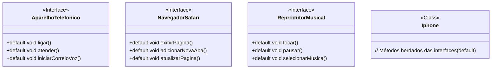

# exercicio-java-iphone

```mermaid
classDiagram
direction TB
    class AparelhoTelefonico {
	    +default void ligar()
	    +default void atender()
	    +default void iniciarCorreioVoz()
    }

    class NavegadorSafari {
	    +default void exibirPagina()
	    +default void adicionarNovaAba()
	    +default void atualizarPagina()
    }

    class ReprodutorMusical {
	    +default void tocar()
	    +default void pausar()
	    +default void selecionarMusica()
    }

    class Iphone {
	    // Métodos herdados das interfaces(default)
    }

	<<Interface>> AparelhoTelefonico
	<<Interface>> NavegadorSafari
	<<Interface>> ReprodutorMusical
	<<Class>> Iphone
```

    Iphone ..|> AparelhoTelefonico
    Iphone ..|> NavegadorSafari
    Iphone ..|> ReprodutorMusical

